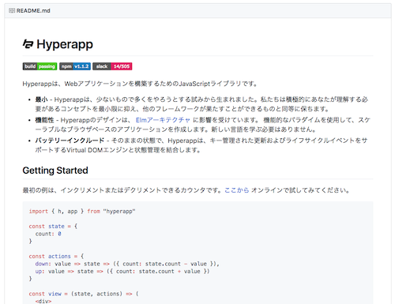

# Taiyaq

Taiyaq(タイヤク)は**プログラマ向けの翻訳サービス**です。

その名前に由来する通り、対訳を皆で共有して翻訳されたドキュメントを読む事ができます。このサービスを使うことで直接最新ライブラリのドキュメントや README を読むことができます。例えば、hyperapp の[README](https://taiyaq.com/contents/PGg8jzP12zX8JtE7LALAdzvOAJ)を直接日本語訳で読めます。



プログラマーが翻訳されたドキュメントを読む際、気にしていることは**最新のパージョンのもの**を読んでいるのか、という点です。大抵ライブラリはバージョンが上がっていきドキュメントの内容も更新されていきます。
**翻訳はその後に行われ**るため、古い情報を参考にライブラリの使いかたを覚えはめになり余計な惨事を招くことになります。

例えばこんな感じです。

* **質問** `React.js` の使いかたについて教えてください。以下のようなコードを書いたんですが、、、

```js
import React from 'react';

var Parent = React.createClass({
    getInitialState:function() {
    return {
            display: "none"
    }
  },
// 省略
```

* **解答** そもそも `createClass`を使うのば ES2015 においては推奨されていません

というようなやり取りです。

そもそも React.js の本家のサイトを参照すればこんな質問が飛ぶことはありませんでした。

つまりインターネットにおいては新旧が混在しているため正しい情報を得ることが難しいのです。翻訳ドキュメントは古い情報を更に翻訳したものですから余計に不利となります。プログラマーは常にこの**古い可能性がある**という点を気にしながらドキュメントを読んでいるのです。

これを解決したく、このサービスが生まれました。
