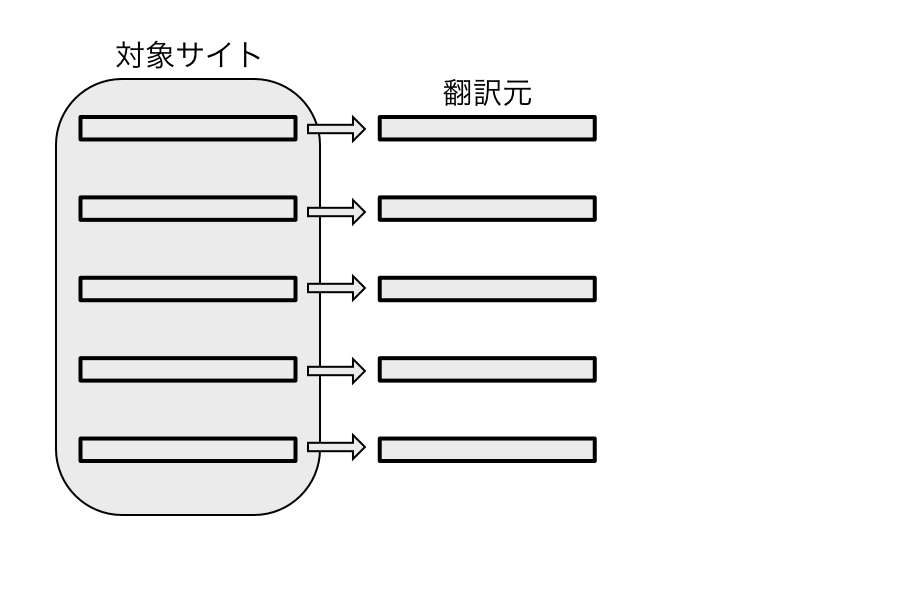
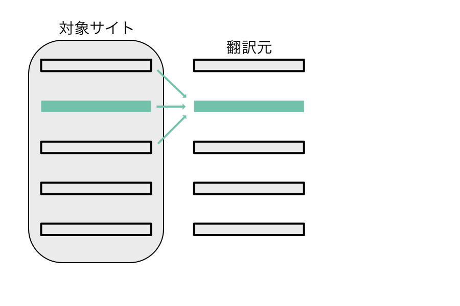
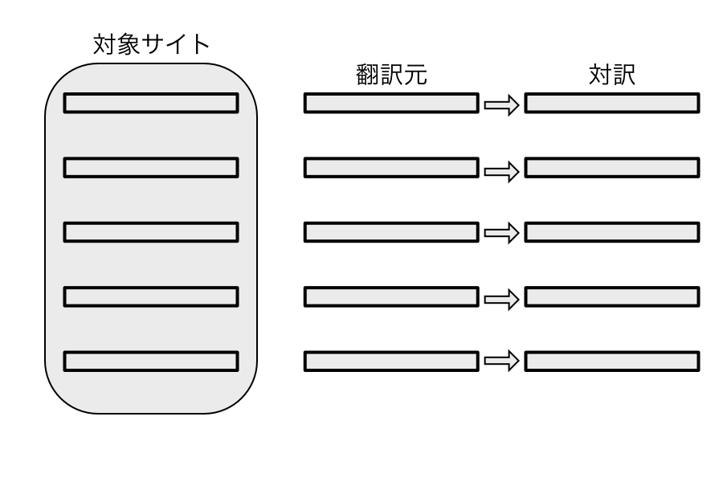
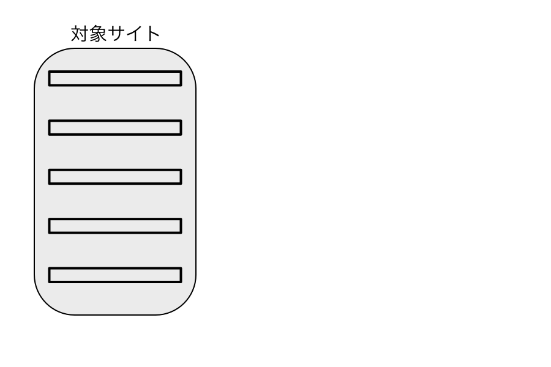
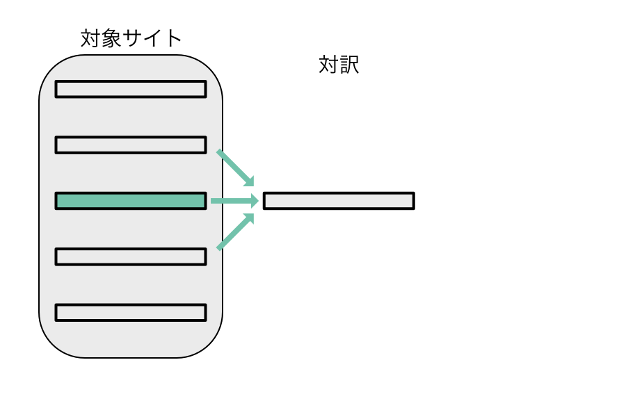
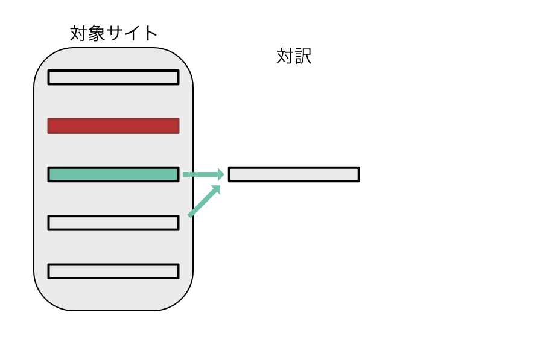
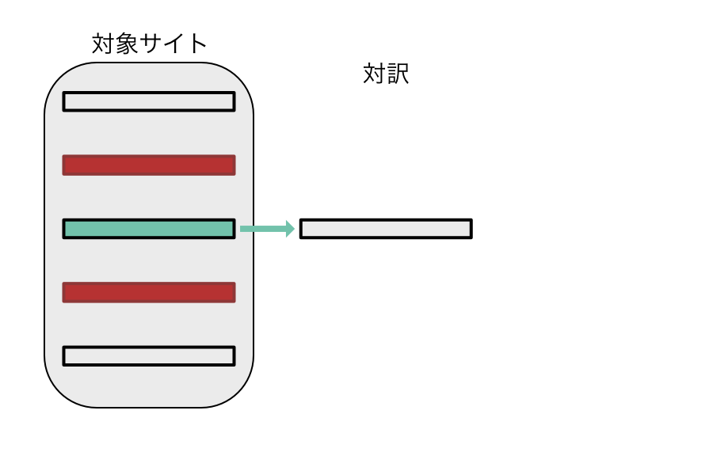
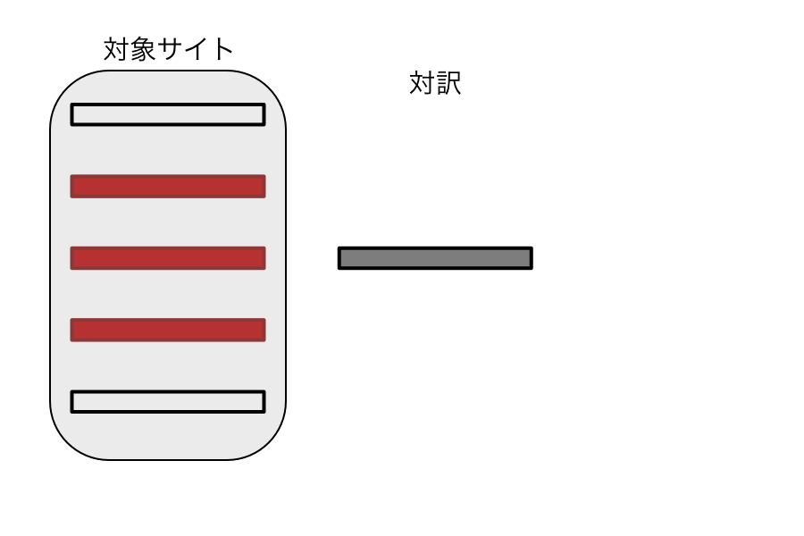

技術ドキュメントは全ての記述を変更することは多くありません。大抵幾つかの仕様が変更され、ドキュメントの修正をそれに合わせたものになります。

事前にドキュメントを分割して翻訳しておけば、**変更された部分以外に関しては翻訳が既存のものを流用**できるはずです。

本サービスはそれを利用したものです。

## 対訳作成の流れについて

Taiyaq は以下のフローによって対訳の作成を進めていきます

ある翻訳したいサイトがあります。そこで新規の対訳作成を選ぶと以下の手順が始まります

### 翻訳対象の分割

翻訳対象サイト を一定単位で分割します。同じコンテンツは同じ分割方法に従い毎回同じように分割されます。

これによって翻訳元となる情報を作成します

### 分割情報のハッシュを作成する

<!-- 対訳の格納方法を見せる -->

対訳は前後の翻訳対象のハッシュも記憶しておきます。つまり一つの対訳は次の情報を対訳とは別に保持します。

* 翻訳対象のハッシュ
* 翻訳対象の一つ前対象のハッシュ
* 翻訳対象の一つ後ろの対象のハッシュ

これは後述する翻訳処理で使われます。

### 対訳の作成

上記分割した翻訳情報を翻訳して対訳をつくっていきます。

この情報をもとに対象サイトの翻訳を行います

## 翻訳の流れについて

Taiyaq は以下のフローによって翻訳を行います。

ある翻訳したいサイトがあります。そこで翻訳を実行しようとすると以下の手順が実行されます。

### 対象サイトの分割

翻訳対象サイト を一定単位で分割します。同じコンテンツは同じ分割方法に従い毎回同じように分割されます。(対訳作成の分割と同じ)

これによって翻訳元となる情報を作成します

### 対応する対訳を使った翻訳を実行

翻訳を行います。但し前述したハッシュ情報を使い大きく３つのパターンに分けて翻訳を実行します

#### 対応する対訳の検出 (完全一致)

これは前後の翻訳元のハッシュと翻訳対のハッシュ(3 つのハッシュ)が完全一致した場合に翻訳されます。完全一致なので最優先で翻訳を実行します。

#### 対応する対訳の検出 (2 箇所一致)

これは前後何れかのハッシュが逸しない場合に翻訳を実行されます。これは前後何れかの翻訳元が変更された場合に実行されます。

部分一致でも翻訳を行いますが完全一致の翻訳が全て終わり残った翻訳対象に対して実行されます。

#### 対応する対訳の検出 (前後不一致)

前後ともハッシュが一致しない場合に翻訳を実行しますこれは前述した**完全一致**, **2 個所一致** にて翻訳した残りの翻訳に対して実行されます。

{}

この仕組みを逆用してタイトル、目次で共通の文言があった場合に敢えて未翻訳とすることで共通個所の翻訳に利用することができます。

{}

#### 対応する対訳の検出 (全不一致)

全てのハッシュが一致しない場合に翻訳をしません。その対訳はもはや翻訳対象外となります。

## 翻訳完了

上記ルールによって翻訳が実行されます。
